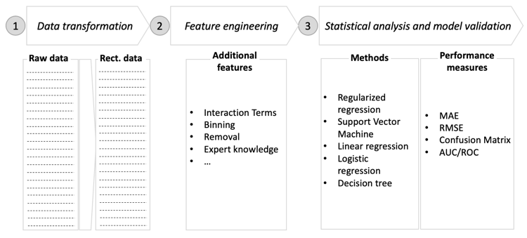
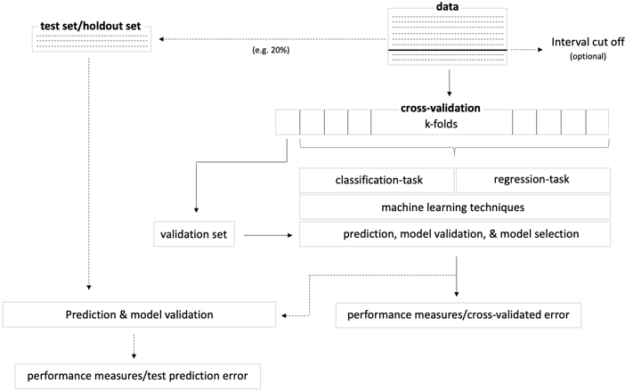

# R package for the analysis of user journey data
This repository consists of a R package and is intended as a framework for user journey analysis in the domain of digital health interventions. It includes functions for the creation of user journey data, feature creation, and an analysis wrapper for statistical analysis and model evaluation.

## Included steps 

### Data transformation
As a first step to analyze user journey data the raw data is transformed into a wide format. The function `reshapeDate` supports this task. When transforming the raw data, it is important to specify the time window defining the time interval for which individual touchpoints are aggregated. The choice of the time window depends on the density of the observations in the raw data and must be chosen by the user. If multiple observations of the same type occur within a time window, the user must also decide how to aggregate these values. The help function of `?reshapeData` includes more information and an example.

### Feature engineering
Feature engineering is the next step when using the R package. Generic approaches for including additional features into the data are supported by this package. Interaction terms such as the product of two original features might increase predictive performance. Binning can be used to pre-process data and reduce observation errors. Furthermore, time-window-based features, which aggregate features for a specific time-interval defined by the user have shown to produce benefits in terms of predictive performance. The help functions of `?createInteractionTerms`, `?binning`, and `?TimeWindow` include more information and an example.

### Statistical analysis and model evaluation
The application of machine learning models in this package follows the figure below. The dataset should be split into a training set for fitting the data and learning patterns and a test (or holdout) set, which is used for evaluating model performance of a selected algorithm. In this framework, logistic regression, linear regression, support vector machines, boosted decision trees, and regularization techniques (L1 and L2) are currently implemented. This framework was developed for regression as well as classification tasks that need to be defined by the user. Users may wish to compare their predictive performance to justify the model selection. To gauge the predictive performance of a specified model, k-fold cross-validation is implemented. For model evaluation, root-mean-square error (RMSE) and mean absolute error (MAE) are implemented for regression. For classification, confusion matrices and receiver operating characteristics (ROC) graphs are implemented. The help function of `?analyzeUJ` includes more information and an example.

## Installation
Clone this repository to your computer or download the repository:

`git clone https://github.com/VBremer/UJ-Analysis.git`

Make sure devtools are installed: 

`install.packages("devtools")`

To build the package, run:

`R CMD build UJ-Analysis`

Now install the package:

`R CMD INSTALL UJAnalysis_0.1.0.tar.gz`

Note that in some cases, the dependencies must be installed manually.

## Usage
The package can now be loaded: `library(UJAnalysis)`

It is now possible to access the help functions such as `?reshapeData` or `?analyzeUJ`.
